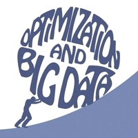

<h1 align="center">Course: Big Data Optimization </h1>

## Course Information
Instructor: [Niao He](http://people.inf.ethz.ch/niaohe/index.html)

### Course Description
> Nearly every problem in machine learning and high-dimensional statistics can be formulated in terms of optimization of some function, possibly under some constraints. In the wake of Big Data era, there is an increasingly strong need to design efficient and scalable algorithms to address optimization problems in large scale - including problems exhibiting inherently high dimensions and problems involving truly massive data sets. The key aim of this course is to expose students to a wide range of modern algorithmic developments in optimization (mainly in convex optimization) and bring them near the frontier of research in large-scale optimization and machine learning. 
 
> *Courtesy warning*: The course will be theory-oriented and emphasize deep understanding of structures of optimization problems and computation complexity of numerical algorithms. The course will not cover any software or tools used for big data analytics and is not an application course.

### Prerequisite
Students are expected to have strong knowledge of linear algebra, real analysis, and probability theory. Some prior exposure to optimization at a graduate level is preferred.

### Textbook
No book is required, but you are highly recommended to read the following:

1. Ben-Tal & Nemirovski. [Lectures on Modern Convex Optimization](http://www2.isye.gatech.edu/~nemirovs/Lect_ModConvOpt.pdf), SIAM, 2011.
2. Nesterov. [Introductory Lectures on Convex Optimization: A Basic Course](http://citeseerx.ist.psu.edu/viewdoc/download?doi=10.1.1.693.855&rep=rep1&type=pdf), Kluwer-Academic, 2003.
3. Sra, Nowozin, Wright (eds). [Optimization for Machine Learning](https://mitpress.mit.edu/books/optimization-machine-learning). MIT Press, 2011.
4. Bubeck. [Convex Optimization: Algorithms and Complexity](http://research.microsoft.com/en-us/um/people/sebubeck/Bubeck15.pdf). In Foundations and Trends in Machine Learning, 2015.

<!-- ### Topical Outlines

- **Part I: Introduction and Fundamentals** (3 weeks): basics of convex analyis, conic programming, machine learning under optimization lenses.
- **Part II: Smooth Convex Optimization** (4 weeks): gradient descent, acceleration, projection-gree methods, coordinate descent, etc. 
- **Part III: Nonsmooth Convex Optimization** (4 weeks): subgradient method, smoothing, Mirror Prox, primal-dual algorithms, proximal and splitting algorithms, etc. 
- **Part IV: Stochastic and Online Optimization** (3 weeks): sample average approximation, stochastic approximation, incremental gradient methods, online algorithms, etc. 
- **Part V: Optimization Perspectives for Selective Topics in Machine Learning** (2 weeks): sparsity learning, large-scale kernel machine, reinforcement learning, deep learning, etc.  -->

### Class Schedule
#### Module I: Introduction and Fundamentals

| Lecture  | Topic | Resources |
| :-----:  | :-------: | :---------: |
| 1 | Introduction to course                  | [[Scribe](./lecture_scribe/IE598-lecture1-introduction.pdf)] |
| 2 | Convex Sets                             | [[Scribe](./lecture_scribe/IE598-lecture2-convex-set.pdf)] |
| 3 | Convex Functions                        | [[Scribe](./lecture_scribe/IE598-lecture3&4-convex-functions.pdf)] |
| 4 | Convex Functions                        | [[Scribe](./lecture_scribe/IE598-lecture3&4-convex-functions.pdf)] |
| 5 | Convex Optimization                     | [[Scribe](./lecture_scribe/IE598-lecture5-covex-optimization.pdf)] |
| 6 | Conic Programming                       | [[Scribe](./lecture_scribe/IE598-lecture6-conic-programming.pdf)] |

#### Module II: Smooth Convex Optimization
| Lecture  | Topic | Resources |
| :-----:  | :-------: | :---------: |
| 7 | Introduction to Optimization Algorithms | [[Scribe](./lecture_scribe/IE598-lecture7-introduction-to-optimization-algorithms.pdf)] |
| 8 | Gradient Descent                        | [[Scribe](./lecture_scribe/IE598-lecture8-gradient-descent.pdf)] |
| 9 | Gradient Descent and Its Acceleration   | [[Scribe](./lecture_scribe/IE598-lecture9-gradient-descent-and-acceleration.pdf)] |
| 10 | Projected Gradient Descent             | [[Scribe](./lecture_scribe/IE598-lecture10-projected-gradient-descent.pdf)] |
| 11 | Conditional Gradient (a.k.a. Frank Wolfe Algorithm) | [[Scribe](./lecture_scribe/IE598-lecture11-conditional-gradient.pdf)] |
| 12 | Coordinate Descent Algorithms          | [[Scribe](./lecture_scribe/IE598-lecture12-coordinate-descent-algorithms.pdf)] |
| 13 | Case Study on Logistic Regression      | [[Scribe](./lecture_scribe/IE598-lecture13-case-study-on-logistic-regression.pdf)] |

#### Module III: Nonsmooth Convex Optimization
| Lecture  | Topic | Resources |
| :-----:  | :-------: | :---------: |
| 14 | Subgradient Method                     | [[Scribe](./lecture_scribe/IE598-lecture14-subgradient-methods.pdf)] |
| 15 | From Subgradient Descent to Mirror Descent | [[Scribe](./lecture_scribe/IE598-lecture15-mirror-descent.pdf)] |
| 16 | Smoothing Techniques I                 | [[Scribe](./lecture_scribe/IE598-lecture16-smoothing-techniques-I.pdf)] |
| 17 | Smoothing Techniques II & Proximal Point Algorithm | [[Scribe](./lecture_scribe/IE598-lecture17-smoothing-techniques-II.pdf)] |
| 18 | Mirror Prox for Saddle Point Problems  | [[Scribe](./lecture_scribe/IE598-lecture18-mirror-prox-algorithm-for-saddle-point-problems.pdf)] |
| 19 | (Accelerated) Proximal Gradient Method | [[Scribe](./lecture_scribe/IE598-lecture19-proximal-gradient-method-and-its-acceleration.pdf)] |
| 20 | Splitting Algorithms | [[Scribe](./lecture_scribe/IE598-lecture20-splitting-algorithms.pdf)] |

#### Module IV: Stochastic and Online Optimization
| Lecture  | Topic | Resources |
| :-----:  | :-------: | :---------: |
| 21 | Sample Average Approximation | [[Scribe](./lecture_scribe/IE598-lecture21-stochastic-optimization.pdf)] |
| 22 | Stochastic Gradient Descent / Mirror Descent| [[Scribe](./lecture_scribe/IE598-lecture22-stochastic-optimization-II.pdf)] |
| 23 | Incremental Gradient Methods for Finite Sum Problems  | [[Scribe](./lecture_scribe/IE598-lecture23-incremental-gradient-algorithms.pdf)] |
| 24 | Summary and Outlook |[[Slides](./lecture_scribe/IE598-lecture24-summary-and-outlook_slides.pdf)]|

## License
